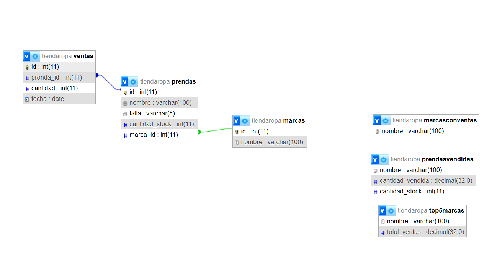

<h1>Proyecto 2</h1>
<h2>Curso: Desarrollo con Plataformas abiertas</h2> 
<h2>Brayan Josué Chacón Molina</h2>

<h3>Actualizar una marca</h3>
Método: PUT
URL: http://localhost/TiendaRopa/API/public/index.php/marcas

Body:

json
{
  "id": 1,
  "nombre": "NombreActualizado"
}

<h3>Eliminar una marca</h3>
Método: DELETE

URL: http://localhost/TiendaRopa/API/public/index.php/marcas

Body:

json
{
  "id": 1
}

<h3>Crear una nueva prenda</h3>
Método: POST

URL: http://localhost/TiendaRopa/API/public/index.php/prendas

Body:

json
{
  "nombre": "NombreDePrenda",
  "talla": "M",
  "cantidad_stock": 50,
  "marca_id": 1
}

<h3>Actualizar una prenda</h3>
Método: PUT

URL: http://localhost/TiendaRopa/API/public/index.php/prendas

Body:

json
{
  "id": 1,
  "nombre": "NombreActualizado",
  "talla": "L",
  "cantidad_stock": 60,
  "marca_id": 2
}

<h3>Eliminar una prenda</h3>
Método: DELETE

URL: http://localhost/TiendaRopa/API/public/index.php/prendas

Body:

json
{
  "id": 1
}

<h3>Crear una nueva venta</h3>
Método: POST

URL: http://localhost/TiendaRopa/API/public/index.php/ventas

Body:

json
{
  "prenda_id": 1,
  "cantidad": 10,
  "fecha": "2024-10-01"
}

<h3>Actualizar una venta</h3>
Método: PUT

URL: http://localhost/TiendaRopa/API/public/index.php/ventas

Body:

json
{
  "id": 1,
  "prenda_id": 1,
  "cantidad": 5,
  "fecha": "2024-10-02"
}

<h3>Eliminar una venta</h3>
Método: DELETE

URL: http://localhost/TiendaRopa/API/public/index.php/ventas

Body:

json
{
  "id": 1
}